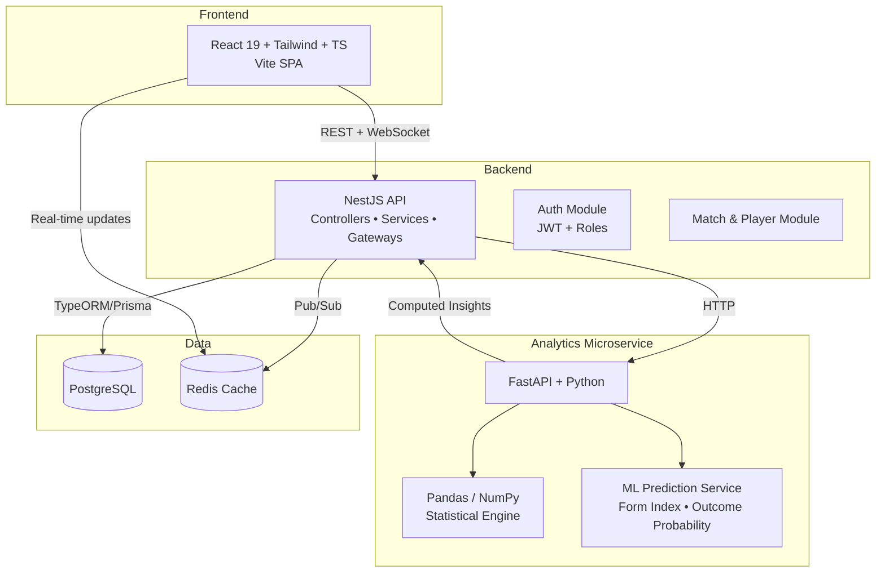

# 🏏 CricPulse

> **Real-time Cricket Analytics Platform** — Modern full-stack application delivering live scores, deep statistical insights, player & team analytics, and ML-powered predictions for the world's most loved sport.

<p align="center">
  
  
  
  
  
  
</p>

---

## 📖 Overview

**CricPulse** is a production-ready full-stack cricket platform that combines a lightning-fast modern frontend, a scalable and type-safe backend, and a dedicated high-performance analytics microservice.

Whether you're a casual fan tracking live matches, a fantasy cricket player looking for an edge, or a data analyst studying player form — CricPulse gives you beautiful, actionable insights in real time.

### Why CricPulse?

- **Blazing fast UI** built on React 19 with first-class TypeScript support
- **Clean architecture** with clear separation between presentation, business logic, and heavy analytics workloads
- **ML-ready analytics engine** capable of delivering match outcome predictions, player form analysis, and advanced metrics
- **Real-time capable** architecture (WebSockets ready)
- Designed with modern best practices, scalability, and developer experience in mind

---

## ✨ Key Features

### 🏟️ Live & Match Experience
- Live ball-by-ball updates and match tracking
- Interactive scorecard with rich statistics
- Real-time push notifications for wickets, milestones & innings updates

### 📊 Deep Analytics & Insights
- Player career dashboards with form trends, consistency metrics & impact scores
- Team performance heatmaps and head-to-head analysis
- Advanced filtering and comparison tools (batting, bowling, all-rounders)

### 🤖 Predictive Intelligence (Analytics Service)
- Match outcome probability engine
- Player performance forecasting
- "Form Index" and "Match Impact Rating" powered by statistical models
- Custom analytics queries via dedicated FastAPI endpoints

### 👤 Personalization
- User accounts with favorite teams & players
- Watchlists and personalized dashboards
- Historical performance tracking

### 🛠️ Developer & Admin Experience
- Fully documented REST APIs (Swagger + Redoc)
- Role-based access control
- Admin panel for match & player data management
- Comprehensive logging and monitoring hooks

---

## 🛠 Tech Stack

### Frontend (`/frontend`)
| Technology       | Purpose                              | Version     |
|------------------|--------------------------------------|-------------|
| **React**        | UI Library                           | 19          |
| **TypeScript**   | Type Safety                          | Latest      |
| **Tailwind CSS** | Utility-first Styling                | Latest      |
| **Vite**         | Build Tool & Dev Server              | Latest      |
| **TanStack Query** | Data Fetching & Caching            | Recommended |
| **Recharts**     | Beautiful Data Visualizations        | Recommended |

### Backend (`/backend`)
| Technology       | Purpose                                   |
|------------------|-------------------------------------------|
| **NestJS**       | Scalable Node.js framework with modules, dependency injection & decorators |
| **TypeScript**   | End-to-end type safety                    |
| **TypeORM** / **Prisma** | ORM for PostgreSQL (flexible choice)   |
| **WebSocket**    | Real-time match updates (Gateway ready)   |
| **Passport + JWT** | Authentication & Authorization         |
| **Swagger**      | Auto-generated API documentation          |

### Analytics Engine (`/analytics`)
| Technology       | Purpose                                      |
|------------------|----------------------------------------------|
| **FastAPI**      | High-performance async Python API            |
| **Pydantic**     | Data validation & settings management        |
| **Pandas + NumPy** | Data manipulation & statistical analysis   |
| **scikit-learn** / **XGBoost** | ML models for predictions (optional)     |
| **Uvicorn**      | ASGI server                                  |
| **SQLAlchemy**   | Database access (optional shared DB layer)   |

### Infrastructure & Tooling
- **PostgreSQL** — Primary database
- **Redis** — Caching & real-time pub/sub (optional but recommended)
- **Docker & Docker Compose** — One-command local development
- **ESLint + Prettier + Husky** — Code quality

---

## 🏗️ System Architecture



**Data Flow Summary:**
1. Frontend requests data from NestJS (REST or WebSocket)
2. NestJS serves cached/aggregated data from PostgreSQL
3. For heavy analytics or predictions → delegates to FastAPI service
4. Analytics service processes data with Pandas/ML and returns structured JSON
5. Real-time match events flow through WebSocket Gateway

---

## 📁 Recommended Project Structure

```
cricpulse/
├── frontend/                 # React 19 + TypeScript + Tailwind
│   ├── src/
│   │   ├── components/
│   │   ├── pages/
│   │   ├── hooks/
│   │   ├── lib/              # API clients, utils
│   │   └── main.tsx
│   ├── tailwind.config.js
│   ├── tsconfig.json
│   └── package.json
│
├── backend/                  # NestJS
│   ├── src/
│   │   ├── modules/
│   │   │   ├── auth/
│   │   │   ├── matches/
│   │   │   ├── players/
│   │   │   ├── teams/
│   │   │   └── analytics/
│   │   ├── common/
│   │   └── main.ts
│   ├── test/
│   └── package.json
│
├── analytics/                # FastAPI + Python
│   ├── app/
│   │   ├── main.py
│   │   ├── routers/
│   │   │   ├── predictions.py
│   │   │   ├── player_stats.py
│   │   │   └── team_analysis.py
│   │   ├── services/
│   │   │   ├── stats_engine.py
│   │   │   └── ml_models.py
│   │   └── schemas/
│   ├── requirements.txt
│   └── Dockerfile
│
├── docker-compose.yml
├── .env.example
├── README.md
└── LICENSE
```

---

## 🚀 Getting Started

### Prerequisites
- **Node.js** ≥ 20.x
- **Python** ≥ 3.11
- **PostgreSQL** ≥ 15 (or use Docker)
- **pnpm** or **npm** (recommended: pnpm)
- Docker & Docker Compose (for easiest setup)

### 1. Clone the Repository

```bash
git clone https://github.com/yourusername/cricpulse.git
cd cricpulse
```

### 2. Environment Setup

Copy the example environment files:

```bash
cp .env.example .env
# Edit .env with your database credentials, JWT secret, etc.
```

### 3. Frontend Setup

```bash
cd frontend
pnpm install          # or npm install
pnpm dev              # Starts Vite dev server at http://localhost:5173
```

### 4. Backend Setup (NestJS)

```bash
cd backend
pnpm install
# Run database migrations (if using TypeORM/Prisma)
pnpm run start:dev    # Starts NestJS at http://localhost:3000
```

API Documentation will be available at:
- Swagger UI: `http://localhost:3000/api`
- Redoc: `http://localhost:3000/docs`

### 5. Analytics Service (FastAPI)

```bash
cd analytics
python -m venv venv
source venv/bin/activate     # Windows: venv\Scripts\activate
pip install -r requirements.txt

uvicorn app.main:app --reload --port 8001
```

Analytics docs available at: `http://localhost:8001/docs`

### 6. One-Command Development with Docker (Recommended)

```bash
docker compose up --build
```

This will start:
- Frontend on `http://localhost:5173`
- Backend (NestJS) on `http://localhost:3000`
- Analytics (FastAPI) on `http://localhost:8001`
- PostgreSQL + Redis

---

## 🔌 API Overview

### NestJS Backend Endpoints (selected)
| Method | Endpoint                        | Description                        | Auth |
|--------|---------------------------------|------------------------------------|------|
| GET    | `/matches/live`                 | Get all live matches               | No   |
| GET    | `/matches/:id/scorecard`        | Detailed ball-by-ball scorecard    | No   |
| GET    | `/players/:id/stats`            | Career + form statistics           | No   |
| POST   | `/analytics/predict`            | Proxy to FastAPI prediction engine | Yes  |
| GET    | `/users/me/watchlist`           | User's favorite players & teams    | Yes  |

### FastAPI Analytics Endpoints
| Method | Endpoint                              | Description                              |
|--------|---------------------------------------|------------------------------------------|
| POST   | `/predict/match-outcome`              | Probability of win for both teams        |
| GET    | `/player/form-index/{player_id}`      | Current form rating + trend              |
| POST   | `/team/head-to-head`                  | Detailed H2H stats + insights            |
| POST   | `/compute/impact-score`               | Custom impact rating for a performance   |

Full interactive documentation available via Swagger at each service.

---

## 🧪 Testing

```bash
# Frontend
cd frontend && pnpm test

# Backend
cd backend && pnpm test

# Analytics
cd analytics && pytest
```

---

## 🤝 Contributing

We welcome contributions! Whether it's:

- New visualization components
- Additional cricket metrics / ML models
- Performance improvements
- Bug fixes or documentation

Please read [CONTRIBUTING.md](CONTRIBUTING.md) (create one if needed) and open a Pull Request.

1. Fork the repo
2. Create your feature branch (`git checkout -b feature/amazing-analytics`)
3. Commit your changes
4. Push to the branch
5. Open a Pull Request

---

## 📄 License

This project is licensed under the **MIT License** — see the [LICENSE](LICENSE) file for details.

---

## 🙏 Acknowledgements

- Inspired by the passion of cricket fans worldwide
- Built with love for clean code, great DX, and beautiful data experiences
- Special thanks to the open-source community behind React, NestJS, FastAPI, and the Python data stack

---

<p align="center">
  Made with ❤️ for the sport we all love.<br/>
  <strong>🏏 CricPulse — Where Data Meets the Pitch.</strong>
</p>
